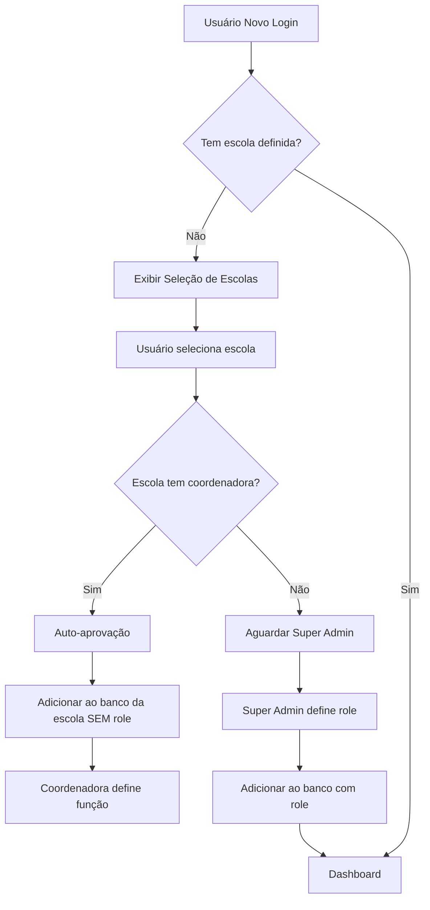

# Sistema de Gerenciamento de Acesso Multi-Tenant

## 📋 Visão Geral

Sistema completo de gerenciamento de acesso de usuários ao sistema multi-tenant ELO School, com validação automática de coordenadora e fluxo de aprovação inteligente.

---

## 🎯 Objetivos

1. **Validação Automática**: Verificar se escola possui coordenadora antes de adicionar usuário
2. **Aprovação Inteligente**: 
   - Auto-aprovação quando escola tem coordenadora
   - Aprovação manual pelo super admin quando escola não tem coordenadora
3. **Segurança**: Garantir que apenas usuários autorizados acessem dados das escolas
4. **Experiência**: Fluxo simples e intuitivo para o usuário final

---

## 🔄 Fluxo do Sistema

### Fluxo Principal



### Estados de Aprovação

1. **`pending`**: Aguardando aprovação do super admin
2. **`auto_approved`**: Aprovado automaticamente (escola com coordenadora)
3. **`manual_approved`**: Aprovado manualmente pelo super admin
4. **`rejected`**: Rejeitado (futuro)

---

## 📁 Estrutura de Arquivos

### Serviços

#### `src/services/userManagementService.js`
Serviço principal de gerenciamento de usuários.

**Principais Funções:**

```javascript
// Verificar se escola tem coordenadora
checkSchoolHasCoordinator(schoolId)
// Retorna: { hasCoordinator: boolean, coordinatorCount: number }

// Solicitar acesso à escola
requestSchoolAccess(userId, schoolId, userData)
// Retorna: { success: boolean, status: string, message: string }

// Adicionar usuário ao banco da escola
addUserToSchoolDatabase(userId, schoolId, userData)
// Retorna: boolean

// Super admin aprovar usuário
approveUserBySuperAdmin(userId, schoolId, role, adminId)
// Retorna: { success: boolean, message: string }

// Buscar aprovações pendentes
getPendingApprovals()
// Retorna: Array de aprovações pendentes

// Buscar escolas disponíveis
getAvailableSchools(userId?)
// Retorna: Array de escolas

// Buscar escolas do usuário
getUserSchools(userId)
// Retorna: Array de escolas associadas ao usuário
```

**Constantes Exportadas:**

```javascript
// Status de aprovação
APPROVAL_STATUS = {
  PENDING: 'pending',
  AUTO_APPROVED: 'auto_approved',
  MANUAL_APPROVED: 'manual_approved',
  REJECTED: 'rejected'
}

// Roles do sistema
USER_ROLES = {
  SUPER_ADMIN: 'superAdmin',
  COORDENADORA: 'coordenadora',
  PROFESSOR: 'professor',
  RESPONSAVEL: 'responsavel',
  SECRETARIA: 'secretaria',
  PENDING: 'pending'
}
```

### Componentes

#### `src/components/SchoolSelection.jsx`
Componente de seleção de escola para usuários novos.

**Características:**
- Lista todas as escolas disponíveis
- Busca por nome ou cidade
- Validação automática de coordenadora
- Feedback visual durante processamento
- Redirecionamento automático após aprovação

**Estados:**
- `schools`: Lista de escolas
- `loading`: Estado de carregamento inicial
- `processing`: Estado de processamento da seleção
- `searchTerm`: Termo de busca
- `error`: Mensagem de erro

#### `src/components/SchoolSelector.jsx` (existente)
Componente que exibe a escola selecionada no header.

### Páginas

#### `src/app/super-admin/pending-approvals/page.jsx`
Interface do super admin para aprovar usuários.

**Funcionalidades:**
- Lista todas as aprovações pendentes
- Estatísticas de aprovações
- Seletor de role para cada usuário
- Aprovação com um clique
- Informações completas da escola e usuário

**Estatísticas Exibidas:**
- Total de pendentes
- Escolas afetadas
- Ações requeridas

#### `src/app/aguardando-aprovacao/page.jsx`
Página de aguardo para usuários sem coordenadora.

**Funcionalidades:**
- Timeline do processo de aprovação
- Verificação de status atualizada
- Informações do usuário
- Botão de refresh manual
- Opção de logout

---

## 🗄️ Estrutura do Banco de Dados

### Management Database

#### `usuarios/{userId}`
```json
{
  "uid": "user123",
  "email": "usuario@email.com",
  "nome": "João Silva",
  "createdAt": "2025-01-15T10:00:00.000Z",
  "updatedAt": "2025-01-15T10:00:00.000Z"
}
```

#### `usuarios/{userId}/escolas/{schoolId}`
```json
{
  "escolaId": "escola123",
  "status": "auto_approved",
  "role": "pending",
  "ativo": true,
  "requestedAt": "2025-01-15T10:00:00.000Z",
  "approvedAt": "2025-01-15T10:01:00.000Z",
  "approvedBy": "auto"
}
```

#### `userSchools/{userId}`
```json
"escola123"
```

#### `pendingApprovals/{schoolId}/{userId}`
```json
{
  "userId": "user123",
  "schoolId": "escola123",
  "email": "usuario@email.com",
  "nome": "João Silva",
  "requestedAt": "2025-01-15T10:00:00.000Z",
  "status": "pending"
}
```

### School Database

#### `usuarios/{userId}`
```json
{
  "email": "usuario@email.com",
  "nome": "João Silva",
  "role": null,
  "ativo": false,
  "turmas": [],
  "createdAt": "2025-01-15T10:00:00.000Z"
}
```

**Observações:**
- **Com coordenadora**: `role = null`, `ativo = false` (coordenadora define depois)
- **Sem coordenadora**: `role = "professor"` (exemplo), `ativo = true` (super admin define)

---

## 🚀 Implementação

### Passo 1: Verificação Inicial

Quando usuário faz login, verificar se tem escola definida:

```javascript
// No AuthContext ou componente principal
useEffect(() => {
  if (user && !selectedSchool) {
    // Buscar escolas do usuário
    const schools = await userManagementService.getUserSchools(user.uid);
    
    if (schools.length === 0) {
      // Redirecionar para seleção de escola
      router.push('/selecionar-escola');
    } else {
      // Carregar escola
      await loadSchoolData(schools[0].id);
    }
  }
}, [user]);
```

### Passo 2: Seleção de Escola

Usuário seleciona escola no componente `SchoolSelection`:

```javascript
const handleSchoolSelection = async (schoolId) => {
  const result = await userManagementService.requestSchoolAccess(
    user.uid,
    schoolId,
    { email: user.email, nome: user.displayName }
  );
  
  if (result.status === APPROVAL_STATUS.AUTO_APPROVED) {
    // Redirecionar para dashboard
    window.location.href = '/dashboard';
  } else {
    // Redirecionar para página de aguardo
    window.location.href = '/aguardando-aprovacao';
  }
};
```

### Passo 3: Aprovação (se necessário)

Super admin acessa `/super-admin/pending-approvals` e aprova:

```javascript
const handleApprove = async (userId, schoolId, role) => {
  const result = await userManagementService.approveUserBySuperAdmin(
    userId,
    schoolId,
    role,
    adminUserId
  );
  
  if (result.success) {
    alert('Usuário aprovado!');
    // Remover da lista
  }
};
```

---

## 🔐 Regras de Segurança

### Management Database

```json
{
  "rules": {
    "usuarios": {
      "$userId": {
        ".read": "$userId === auth.uid || root.child('usuarios/' + auth.uid + '/role').val() === 'superAdmin'",
        ".write": "$userId === auth.uid || root.child('usuarios/' + auth.uid + '/role').val() === 'superAdmin'"
      }
    },
    "pendingApprovals": {
      ".read": "root.child('usuarios/' + auth.uid + '/role').val() === 'superAdmin'",
      ".write": "root.child('usuarios/' + auth.uid + '/role').val() === 'superAdmin'"
    },
    "escolas": {
      ".read": "auth != null",
      "$schoolId": {
        ".write": "root.child('usuarios/' + auth.uid + '/role').val() === 'superAdmin'"
      }
    }
  }
}
```

### School Database

```json
{
  "rules": {
    "usuarios": {
      "$userId": {
        ".read": "$userId === auth.uid || data.child('usuarios/' + auth.uid + '/role').val() === 'coordenadora'",
        ".write": "data.child('usuarios/' + auth.uid + '/role').val() === 'coordenadora'"
      }
    }
  }
}
```

---

## 🎨 Interface do Usuário

### Tela de Seleção de Escola

- **Layout**: Grid responsivo de cards
- **Busca**: Campo de texto com ícone de lupa
- **Cards**: Logo, nome, cidade da escola
- **Estado de loading**: Spinner durante processamento
- **Feedback**: Mensagens de sucesso/erro

### Tela de Aprovações Pendentes

- **Estatísticas**: Cards com total, escolas afetadas, ações requeridas
- **Lista**: Cards com info do usuário, escola, seletor de role
- **Ações**: Botão de aprovar com feedback visual
- **Filtros**: (futuro) Por escola, por data

### Tela de Aguardando Aprovação

- **Timeline**: Visualização do processo (3 etapas)
- **Status**: Indicação clara do estágio atual
- **Ações**: Refresh manual, logout
- **Informações**: Dados do usuário e próximos passos

---

## 📊 Logs e Monitoramento

### Logs Implementados

```javascript
console.log('🔍 [UserManagement] Verificando coordenadora na escola: escola123');
console.log('✅ [UserManagement] Coordenadoras encontradas: 2');
console.log('📝 [UserManagement] Solicitação de acesso');
console.log('⏳ [UserManagement] Usuário adicionado à fila de aprovação do super admin');
console.log('👑 [UserManagement] Super admin aprovando usuário');
```

### Eventos Importantes

1. Verificação de coordenadora
2. Solicitação de acesso
3. Auto-aprovação
4. Adição à fila de super admin
5. Aprovação manual
6. Erros de validação

---

## 🧪 Casos de Teste

### Teste 1: Escola com Coordenadora

**Entrada:**
- Usuário novo (sem escola)
- Seleciona "Escola A" (tem 2 coordenadoras)

**Esperado:**
- Status: `auto_approved`
- Usuário adicionado ao banco da escola sem role
- Redirecionado para dashboard
- Mensagem: "Acesso concedido! Aguardando aprovação da coordenadora..."

### Teste 2: Escola sem Coordenadora

**Entrada:**
- Usuário novo (sem escola)
- Seleciona "Escola B" (não tem coordenadora)

**Esperado:**
- Status: `pending`
- Adicionado a `pendingApprovals`
- Redirecionado para `/aguardando-aprovacao`
- Mensagem: "Solicitação enviada! Aguardando aprovação..."

### Teste 3: Super Admin Aprova

**Entrada:**
- Super admin acessa `/super-admin/pending-approvals`
- Seleciona role "professor"
- Clica em "Aprovar"

**Esperado:**
- Status atualizado para `manual_approved`
- Usuário adicionado ao banco da escola COM role
- Removido de `pendingApprovals`
- Mensagem: "Usuário aprovado como professor com sucesso!"

---

## 🔄 Fluxos Alternativos

### Usuário já tem escola pendente

```javascript
// Verificar antes de mostrar seleção
const pendingSchool = await checkUserPendingSchool(userId);
if (pendingSchool) {
  // Redirecionar direto para aguardando aprovação
  router.push('/aguardando-aprovacao');
}
```

### Usuário tenta acessar múltiplas escolas

**Opção 1**: Permitir (futuro)
- Usuário pode estar em múltiplas escolas
- Seletor de escola ativo no header

**Opção 2**: Bloquear (atual)
- Usuário só pode estar em uma escola
- Precisa desvincular para trocar

---

## 📝 TODO / Melhorias Futuras

### Curto Prazo

- [ ] Notificações por email quando usuário é aprovado
- [ ] Logs detalhados de todas as ações
- [ ] Página de histórico de aprovações

### Médio Prazo

- [ ] Painel de analytics para super admin
- [ ] Exportação de relatórios
- [ ] Sistema de rejeitamento com motivo
- [ ] Múltiplas escolas por usuário

### Longo Prazo

- [ ] Workflow de aprovação com múltiplos níveis
- [ ] Sistema de convites por email
- [ ] Integração com sistema de notificações em tempo real
- [ ] Auditoria completa de todas as ações

---

## 🐛 Troubleshooting

### Problema: Usuário não aparece em aprovações pendentes

**Verificar:**
1. Status do usuário no management DB
2. Nó `pendingApprovals/{schoolId}/{userId}` existe?
3. Console do navegador para erros

### Problema: Auto-aprovação não funciona

**Verificar:**
1. Escola realmente tem coordenadora?
2. Coordenadora está com `ativo: true`?
3. Role da coordenadora está correta?

### Problema: Não consegue acessar após aprovação

**Verificar:**
1. Usuário foi adicionado ao banco da escola?
2. `ativo: true` no banco da escola?
3. Role foi definida corretamente?
4. Cache do navegador limpo?

---

## 📞 Suporte

Para dúvidas ou problemas:
- **Email**: suporte@eloschool.com.br
- **Documentação**: `/docs`
- **Issues**: GitHub Issues

---

## 📜 Changelog

### v1.0.0 (2025-01-15)

**Adicionado:**
- Sistema completo de gerenciamento de acesso
- Validação automática de coordenadora
- Fluxo de aprovação inteligente
- Interface para super admin
- Página de aguardo de aprovação
- Documentação completa

**Estrutura:**
- `userManagementService.js`
- `SchoolSelection.jsx`
- `pending-approvals/page.jsx`
- `aguardando-aprovacao/page.jsx`
- `SISTEMA-GERENCIAMENTO-ACESSO.md`

---

## 🔗 Links Relacionados

- [Arquitetura Multi-Tenant](../architecture/ARQUITETURA-MULTI-TENANT.md)
- [Fluxo de Autenticação](../systems/NOVO-FLUXO-AUTENTICACAO.md)
- [Sistema de Permissionamento](../systems/SISTEMA-PERMISSIONAMENTO-NIVEIS.md)
- [Guia de Testes Multi-Tenant](../guides/GUIA-TESTES-MULTI-TENANT.md)
